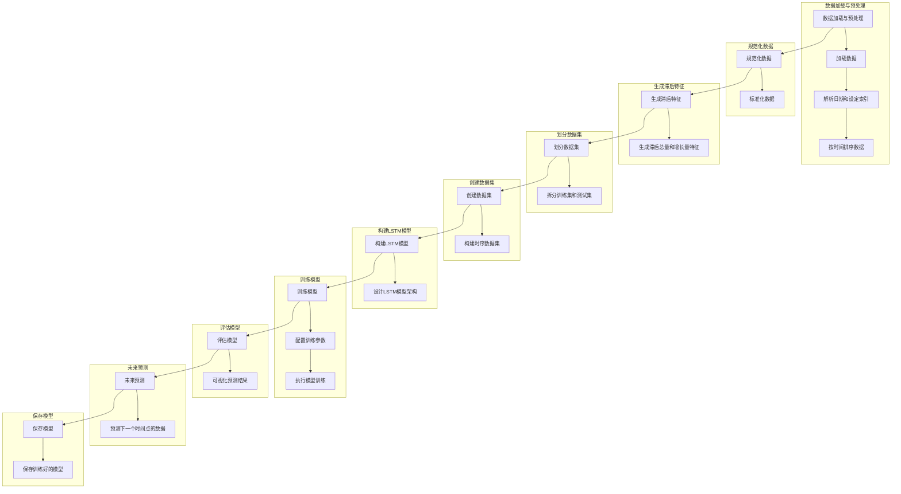
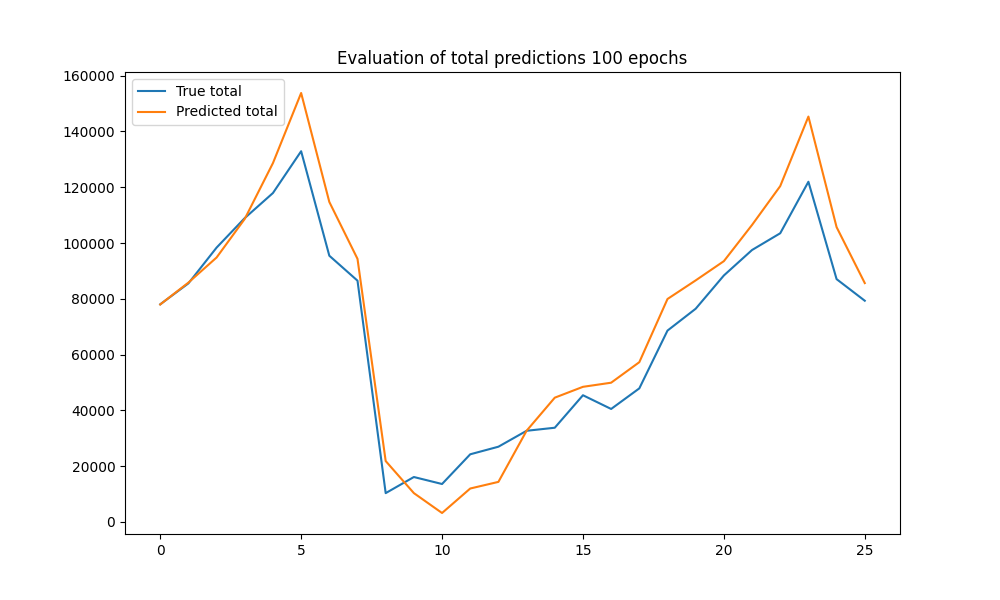
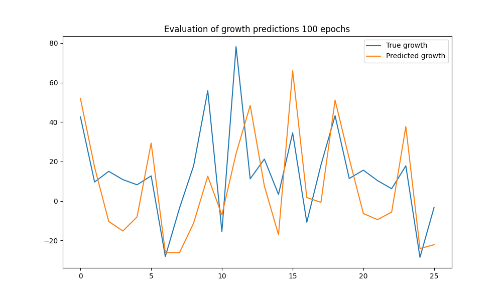
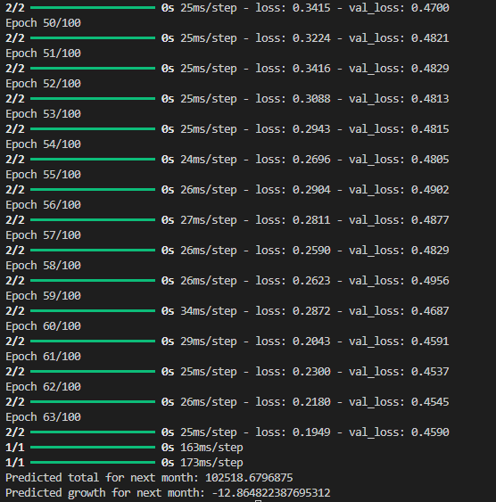

# LSTM 时间序列预测模型

本项目旨在使用 LSTM 模型进行时间序列预测，预测中国商品住宅销售额总量（total）和增长量（growth）
以下文档将详细介绍如何加载数据、预处理数据、生成滞后特征、构建和训练模型以及进行预测

## 目录

- [LSTM 时间序列预测模型](#lstm-时间序列预测模型)
  - [目录](#目录)
  - [项目背景](#项目背景)
  - [数据来源](#数据来源)
  - [应用场景](#应用场景)
  - [模型选择与开发](#模型选择与开发)
  - [实现技术](#实现技术)
  - [程序架构](#程序架构)
  - [环境配置](#环境配置)
  - [项目结构](#项目结构)
  - [代码说明](#代码说明)
    - [加载和预处理数据](#加载和预处理数据)
    - [规范化数据](#规范化数据)
    - [生成滞后特征](#生成滞后特征)
    - [划分数据集](#划分数据集)
    - [创建数据集](#创建数据集)
    - [构建LSTM模型](#构建lstm模型)
    - [训练模型](#训练模型)
    - [评估模型](#评估模型)
    - [预测](#预测)
  - [运行主函数](#运行主函数)
  - [模型保存](#模型保存)
  - [模型评估](#模型评估)
  - [运行结果](#运行结果)

## 项目背景

> 本项目旨在利用长短期记忆网络（LSTM）模型预测中国商品住宅销售额的总量（total）和增长量（growth）
> 商品住宅销售额是衡量房地产市场活跃度和经济健康的重要指标之一，对政策制定、市场预期和投资决策具有重要意义。

## 数据来源

- 采集自[中华人民共和国国家统计局](https://data.stats.gov.cn/index.htm)包括月度销售额和增长率
- 数据统计时间为 2006年2月 至 2024年4月，共201月
- 数据经过预处理和特征工程，包括时间序列排序、滞后特征生成等步骤，以便于模型训练和预测

## 应用场景

- **政策制定支持**： 政府部门可以利用模型预测结果，及时调整宏观经济政策，以促进商品住宅市场的稳定发展
- **市场预期分析**： 房地产开发商和投资者可以根据预测结果制定战略，优化资源配置，降低市场风险
- **财务规划**： 公司可以利用预测结果进行财务规划和预算编制，优化销售策略和市场定位

## 模型选择与开发
- **模型选择**: 使用长短期记忆网络（LSTM）模型，因其适用于处理时间序列数据和捕捉序列中的长期依赖关系
- **开发过程**: 数据加载、预处理、模型构建、训练、评估和预测等步骤，详见[代码说明](#代码说明)

## 实现技术

- **编程语言：** Python
- **主要库和框架：**
  - Pandas：用于数据处理和特征工程。
  - NumPy：用于数值计算和数组操作。
  - Keras：用于构建和训练深度学习模型。
  - Scikit-learn：用于数据预处理和模型评估。
  - Matplotlib：用于可视化模型评估结果。


## 程序架构



## 环境配置

确保你已经安装了以下Python库：

- numpy
- pandas
- scikit-learn
- keras
- matplotlib

你可以使用以下命令安装所需库：

```bash
pip install numpy pandas scikit-learn keras matplotlib
```

## 项目结构

项目的主要代码文件为 `predicate.py`。该文件包含了所有必要的函数和主程序

## 代码说明

### 加载和预处理数据

- **加载数据 (load_and_preprocess_data)**: 从CSV文件中加载数据，并使用parse_dates解析日期，将时间列设为索引
- **解析日期和设定索引**: 将时间列解析为日期格式，并设定为数据的索引，确保数据按时间顺序排列。
```python
def load_and_preprocess_data(filepath):
    data = pd.read_csv(filepath)
    data['time'] = pd.to_datetime(data['time'], format='%b-%y')
    data.sort_values('time', inplace=True)
    data.set_index('time', inplace=True)
    return data
```

### 规范化数据

- **标准化数据 (normalize_data)**: 使用StandardScaler对数据中的total和growth列进行标准化，使其在相似的数值范围内
```python
def normalize_data(data):
    scaler = MinMaxScaler()
    data[['total', 'growth']] = scaler.fit_transform(data[['total', 'growth']])
    return data, scaler
```

### 生成滞后特征

- **生成滞后总量和增长量特征 (generate_lag_features)**: 对total和growth列生成多个滞后特征，用于增强模型捕捉时间序列的时间相关性
```python
def generate_lag_features(data, num_lags=12):
    for lag in range(1, num_lags + 1):
        data[f'total_lag_{lag}'] = data['total'].shift(lag)
        data[f'growth_lag_{lag}'] = data['growth'].shift(lag)
    data.dropna(inplace=True)
    return data
```

### 划分数据集

- **拆分训练集和测试集 (split_data)**: 将数据集按照指定的比例划分为训练集和测试集，用于模型训练和评估
```python
def split_data(data, train_ratio=0.8):
    train_size = int(len(data) * train_ratio)
    train, test = data.iloc[:train_size], data.iloc[train_size:]
    X_train, y_train = train.drop(columns=['total', 'growth']), train[['total', 'growth']]
    X_test, y_test = test.drop(columns=['total', 'growth']), test[['total', 'growth']]
    return X_train, y_train, X_test, y_test
```

### 创建数据集

- **构建时序数据集 (create_dataset)**: 将滞后特征转换为适合LSTM输入的时序数据集，包括历史数据作为特征和下一个时间点作为标签
```python
def create_dataset(X, y, time_steps=1):
    Xs, ys = [], []
    for i in range(len(X) - time_steps):
        v = X.iloc[i:(i + time_steps)].values
        Xs.append(v)
        ys.append(y.iloc[i + time_steps].values)
    return np.array(Xs), np.array(ys)
```

### 构建LSTM模型

- **设计LSTM模型架构 (build_lstm_model)**: 使用Sequential模型构建LSTM模型，包括多层LSTM单元和Dropout层，以防止过拟合
```python
def build_lstm_model(input_shape, optimizer='adam'):
    model = Sequential()
    model.add(LSTM(50, return_sequences=True, input_shape=input_shape))
    model.add(Dropout(0.2))
    model.add(LSTM(50, return_sequences=False))
    model.add(Dropout(0.2))
    model.add(Dense(25))
    model.add(Dense(2))  # Predicting two values: total and growth
    model.compile(optimizer=optimizer, loss='mean_squared_error')
    return model
```

### 训练模型

- **配置训练参数**: 设置训练的epoch数、batch大小、验证集比例和早停策略
- **执行模型训练 (train_model)**: 使用训练数据训练构建好的LSTM模型，监控验证集上的损失并进行早停，防止模型过拟合
```python
def train_model(model, X_train, y_train, epochs=50, batch_size=32, validation_split=0.1, patience=10):
    early_stopping = EarlyStopping(monitor='val_loss', patience=patience)
    history = model.fit(X_train, y_train, epochs=epochs, batch_size=batch_size, validation_split=validation_split, shuffle=False, callbacks=[early_stopping])
    return history
```

### 评估模型

- **可视化预测结果 (evaluate_model)**: 使用训练好的模型对测试集进行预测，并将预测结果与真实值进行比较，通过图表展示预测效果
```python
def evaluate_model(model, X_test, y_test, scaler):
    predictions = model.predict(X_test)
    predictions = scaler.inverse_transform(predictions)
    y_test = scaler.inverse_transform(y_test)

    plt.figure(figsize=(10, 6))
    plt.plot(y_test[:, 0], label='True total')
    plt.plot(predictions[:, 0], label='Predicted total')
    plt.title('Evaluation of total predictions')
    plt.legend()
    plt.show()

    plt.figure(figsize=(10, 6))
    plt.plot(y_test[:, 1], label='True growth')
    plt.plot(predictions[:, 1], label='Predicted growth')
    plt.title('Evaluation of growth predictions')
    plt.legend()
    plt.show()
```

### 预测

- **预测下一个时间点的数据 (future_prediction)**: 利用训练好的模型对未来时间点的数据进行预测，展示模型在实际应用中的预测能力
```python
def future_prediction(model, X_test, scaler):
    last_data = X_test[-1]
    last_data = np.expand_dims(last_data, axis=0)
    future_pred = model.predict(last_data)
    future_pred = scaler.inverse_transform(future_pred)
    return future_pred
```

## 运行主函数

- **保存训练好的模型 (model.save)**: 将训练完成的LSTM模型保存为文件，以备将来在其他数据集或应用中使用
```python
def main():
    data = load_and_preprocess_data('data.csv')
    data, scaler = normalize_data(data)
    data = generate_lag_features(data)
    
    X_train, y_train, X_test, y_test = split_data(data)
    
    time_steps = 12
    X_train, y_train = create_dataset(X_train, y_train, time_steps)
    X_test, y_test = create_dataset(X_test, y_test, time_steps)
    
    model = build_lstm_model((X_train.shape[1], X_train.shape[2]))
    train_model(model, X_train, y_train, epochs=100, batch_size=64, validation_split=0.2, patience=20)
    
    model.save('lstm_model.h5')
    
    evaluate_model(model, X_test, y_test, scaler)
    
    future_pred = future_prediction(model, X_test, scaler)
    print(f'Predicted total for next month: {future_pred[0, 0]}')
    print(f'Predicted growth for next month: {future_pred[0, 1]}')

if __name__ == "__main__":
    main()
```

## 模型保存

训练完成后，模型会被保存为 `lstm_model.keras` 文件，可以通过以下命令加载：

```python
from keras.models import load_model
model = load_model('lstm_model.keras')
```

## 模型评估




## 运行结果
